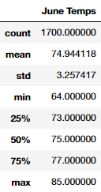
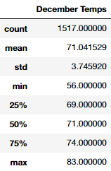
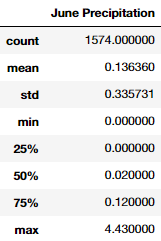
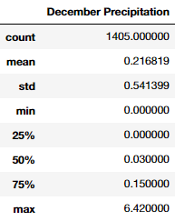
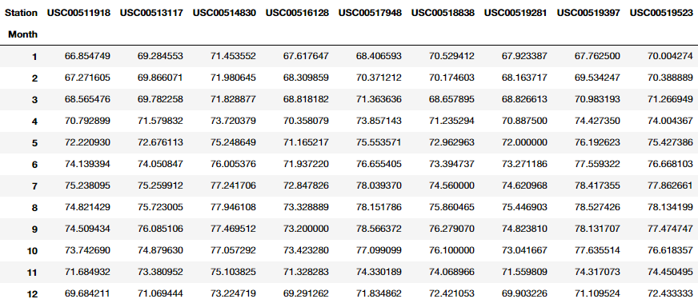
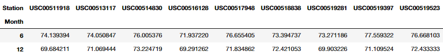

# Challenge - Surfs Up Analysis

## Challenge - Overview

The module walks us through creating and running analysis on weather data for the island of Oahu, using Python, SQLite/SQLAlchemy, Pandas, and for displaying the findings, Flask. We look at the type of weather on this Hawaiian island as a precursor to opening a Surf and Ice Cream store. We are running the analysis to show to the investor that the weather throughout the year will not affect this business being profitable year-round. Our goal being to convince the investor that investing is a wise choice and to support us creating our business.

For the challenge portion of the module, we run two queries to find all the temperatures for the months of June and December from the dataset. Then we use Pandas to display a summary statistics table for each month. These results are detailed below.

## Challenge - Results

We find the temperatures for June using the following query:

```py
results = session.query(Measurement.tobs)\
            .filter(extract('month', Measurement.date) == 6)
```

And similarly for December, but with the extracted month matching `12` rather than `6`. Here we have used the query method on the Python-SQLite session with a filter. For the filter we have employed the use of the SQLAlchemy function `extract` which allows us to extract the month from the date string and compare it to a month value of our choosing. `6` for the sixth month June, and `12` as December.

After the query is returned, we turn it into a list with `.all()`, and then a DataFrame with `pd.DataFrame()`, before showing a table of statistical values with `.describe()`. Below you can see the returned statistics:

| June Temperatures | December Temperatures |
:------------------:|:----------------------:
 | 

### Query Takeaways

- The **mean** temperature is 5 degrees higher in June than in December. It's not unexpected that June is warmer on average than December, as Oahu is an island in the Norther Hemisphere.
- The **minimum temperature** statistic shows the largest difference between the two months, with June a full 8 degrees higher than December. For December, this minimum temperature is 4 standard deviations from the mean though, so this may be an outlier and would need to be investigated further. For June, the minimum is only about 3 standard deviations from the mean, likely meaning a tighter spread of temperatures.
- The **maximum temperature** has a difference of only 2 degrees, again this could be an outlier, as the differences in the other temperature measurements are much larger when comparing months. We would need to investigate how often temperatures were getting near the max, which given how far from the mean it is would likely mean it is a rare occurrence.
- The **quartile spread** of temperatures seems similar for both June and December, with half of the temperatures falling in a 4-5-degree range. This would mean that you could, on a random day in either of those months, have a 50% chance of having the temperature fall in these ranges. This would allow you to plan around the weather with a good deal of accuracy.

## Challenge - Summary

We were tasked with proving that the weather would be good enough year-round to invest in a Surf and Ice Cream store and comparing the temperatures from June to December shows that it would be - at least by temperature. In June and December combined there is almost a **75% chance that the temperature on a given day is 70 degrees or greater**. This means that you are looking at a store that is providing warm weather products on an island that at least 75% of the time would be considered warm (by temperature measurement alone). If an investor were to base their investment on temperature alone, they should be very happy with the temperature findings reported here.

However, there is more to consider than just the temperature in two given months of the year, even if the data is taken from more than just one year. Temperature is not the only measure of good weather; we would also want to consider the precipitation as well before investing. We briefly looked at precipitation levels in the module, so running a query here to **compare the amount of precipitation in June and December** makes sense. This is how we run the query:

```py
# Compare the amount of preciptation in June and December.
june_precip = session.query(Measurement.prcp) \
              .filter(extract('month', Measurement.date) == 6).all()
dec_precip = session.query(Measurement.prcp) \
              .filter(extract('month', Measurement.date) == 12).all()
# Convert to DataFrames.
june_precip_df = pd.DataFrame(june_precip, columns=["June Precipitation"])
dec_precip_df = pd.DataFrame(dec_precip, columns=["December Precipitation"])
```

And this gives us the statistical output for each month that we can compare:

| June Precipitation | December Precipitation |
:-------------------:|:-----------------------:
 | 

Another query we could run is to find **the average temperature by station, by month**. This would give us a good idea of the temperatures throughout the year at the various station locations. Obviously the most important station would be the one closest to our store, but this could help decide where we should locate our store in the first place. This query also allows us to plan out future locations of our stores after ours proves to be a success. The query we run is:

```py
# Run the query to find the average temperature by station, by month.
avg_stn_temps = session.query(Measurement.station, extract('month', Measurement.date), func.avg(Measurement.tobs))\
        .group_by(Measurement.station, extract('month', Measurement.date))\
        .order_by(extract('month', Measurement.date), Measurement.station)\
        .all()
# Convert the list to a DataFrame.
avg_stn_temps_df = pd.DataFrame(avg_stn_temps, columns=['Station', 'Month', 'Average Temp'])
# Pivot the DataFrame to use the months as the row indices and the stations as column headers.
avg_stn_temps_df.pivot(index='Month', columns='Station', values='Average Temp')
```

Which produces our output:



If we are still focusing on June and December as our main comparisons, we would filter the query by those months:

```py
# FILTER BY JUNE AND DECEMBER
# Run the query to find the average temperature by station, by month.
avg_stn_temps = session.query(Measurement.station, extract('month', Measurement.date), func.avg(Measurement.tobs))\
        .filter((extract('month', Measurement.date) == 6) | (extract('month', Measurement.date) == 12))\
        .group_by(Measurement.station, extract('month', Measurement.date))\
        .order_by(extract('month', Measurement.date), Measurement.station)\
        .all()
# Convert the list to a DataFrame.
avg_stn_temps_df = pd.DataFrame(avg_stn_temps, columns=['Station', 'Month', 'Average Temp'])
# Pivot the DataFrame to use the months as the row indices and the stations as column headers.
avg_stn_temps_df.pivot(index='Month', columns='Station', values='Average Temp')
```

Which produces our **June-December average temperatures by station (by month)** output:



## Context

This is the result of Module 8 of the University of Toronto School of Continuing Studies Data Analysis Bootcamp Course - **Python and SQLite** - Advanced Data Storage and Retrieval. Following the guidance of the module we end up pushing this selection of files to GitHub.
